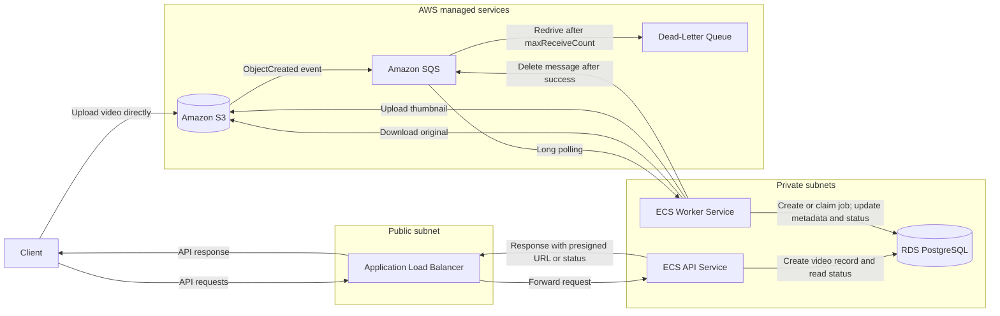

# Video Processing Platform

## Goal

Build a small backend-focused application for learning containerized workloads on AWS. The business logic remains intentionally simple so the project can focus on ECS, Fargate, networking, asynchronous processing, reliability, and operations.

The first processing version extracts video metadata and generates one thumbnail.

## High-Level Architecture



## Components

- **Application Load Balancer:** routes public HTTP requests to the API service.
- **ECS API Service:** manages video records, presigned URLs, processing jobs, and status requests.
- **ECS Worker Service:** polls SQS and processes videos independently of the API.
- **Amazon S3:** stores original videos and generated assets and publishes upload events to SQS.
- **Amazon SQS:** decouples uploads from processing and provides retry behavior.
- **Amazon RDS PostgreSQL:** stores videos, jobs, metadata, and asset records.
- **Amazon ECR:** stores API and worker container images.
- **CloudWatch:** collects logs, metrics, and alarms.
- **Secrets Manager:** stores database credentials and other secrets.

## API and System Flows

### 1. Initialize an Upload

```http
POST /videos
Content-Type: application/json

{
  "filename": "demo.mp4",
  "content_type": "video/mp4"
}
```

```text
Client
  → ALB
  → API service
  → PostgreSQL: create Video(status=pending_upload) with an expected object key
  → S3: generate a presigned PUT URL for uploads/{video_id}/original
  ← Video ID, upload URL, and expiration
```

Example response:

```json
{
  "id": "video-id",
  "status": "pending_upload",
  "upload_url": "https://...",
  "expires_at": "..."
}
```

The client uploads the video directly to S3 using the presigned URL:

```text
Client → S3
```

Video bytes do not pass through the API, ALB, or API containers.

### 2. Publish the Upload Event

```text
Client
  → Upload the video using the presigned URL
  → S3 stores the completed object
  → S3 publishes an ObjectCreated event
  → SQS receives the event
```

The S3 event notification should be limited to the prefix used for original uploads:

```text
uploads/
```

S3 event notifications use at-least-once delivery and can arrive more than once or out of order. The object key contains the video ID so the worker can correlate the event with the existing database record. Uploading the object does not require a second client request to the API.

### 3. Process the Video

The worker is a long-running ECS service rather than an HTTP endpoint.

```text
ECS worker service
  → Long-poll SQS
  → Receive an S3 ObjectCreated event
  → Derive the video ID from the object key
  → Verify the expected video record and object key
  → Inspect the object using an S3 HEAD request
  → PostgreSQL: create or claim the processing job atomically
  → Set the job and video statuses to processing
  → Download the original video from S3
  → Run ffprobe to extract metadata
  → Run ffmpeg to generate a thumbnail
  → Upload the thumbnail to S3
  → PostgreSQL transaction:
      save video metadata
      create GeneratedAsset
      mark the job and video completed
  → Delete the SQS message
```

If processing fails:

```text
Worker
  → Record the attempt and error
  → Leave the SQS message undeleted
  → SQS makes the message visible again
  → Another processing attempt begins
  → SQS moves the message to the dead-letter queue after the retry limit
```

SQS provides at-least-once delivery, so the worker must safely handle duplicate messages. If the job is already completed, the worker should not process it again.

The SQS visibility timeout must be longer than the expected processing time. If processing may exceed it, the worker should extend the visibility timeout while working.

### 4. Retrieve Processing Status

```http
GET /videos/{video_id}
```

```text
Client
  → ALB
  → API service
  → PostgreSQL: load the video, job, metadata, and assets
  → S3: generate temporary download URLs for completed assets
  ← Status, metadata, assets, and processing error
```

Example response while processing:

```json
{
  "id": "video-id",
  "filename": "demo.mp4",
  "status": "processing",
  "metadata": null,
  "assets": []
}
```

Example response after completion:

```json
{
  "id": "video-id",
  "filename": "demo.mp4",
  "status": "completed",
  "metadata": {
    "duration_seconds": 42.5,
    "width": 1920,
    "height": 1080,
    "codec": "h264"
  },
  "assets": [
    {
      "type": "thumbnail",
      "download_url": "https://...",
      "expires_at": "..."
    }
  ]
}
```

Clients poll this endpoint while processing is in progress. WebSockets and push notifications are outside the initial scope.

## Status Model

```text
pending_upload
    ↓
queued
    ↓
processing
   ↙       ↘
failed   completed
```

Video and processing-job statuses are stored separately:

```text
Video: pending_upload → queued → processing → completed | failed
ProcessingJob: queued → processing → completed | failed
```

## Supporting Endpoints

```http
GET /health/live
GET /health/ready
```

- `live` reports whether the API process is running.
- `ready` reports whether the API is ready to receive traffic and can access required dependencies.

A manual retry endpoint can be added after the core flow works:

```http
POST /videos/{video_id}/retry
```

It should accept only videos whose processing has terminally failed and must not create duplicate active jobs.

## Data Model

### Video

- `id`
- `filename`
- `content_type`
- `file_size`
- `original_object_key`
- `status`
- `duration_seconds`
- `width`
- `height`
- `codec`
- `error_message`
- `created_at`
- `updated_at`

### Processing Job

- `id`
- `video_id`
- `job_type`
- `status`
- `attempts`
- `error_message`
- `started_at`
- `completed_at`
- `created_at`
- `updated_at`

A database uniqueness constraint should prevent duplicate active or completed jobs for the same video and job type.

### Generated Asset

- `id`
- `video_id`
- `asset_type`
- `object_key`
- `created_at`

S3 object keys are stored in PostgreSQL. Public or presigned URLs are generated only when responding to a client.

## Implementation Plan

1. Build the API, worker, PostgreSQL schema, and queue flow locally.
2. Add direct-to-object-storage uploads using presigned URLs.
3. Implement metadata extraction with `ffprobe`.
4. Implement one thumbnail using `ffmpeg`.
5. Containerize the API and worker separately.
6. Provision the VPC, S3, RDS, SQS, ECR, ECS, and ALB using infrastructure as code.
7. Deploy one API task and one worker task.
8. Add retries, idempotent processing, and the dead-letter queue.
9. Add CloudWatch logs, metrics, alarms, and dashboards.
10. Configure independent API and worker autoscaling.
11. Practice operations by intentionally testing task failures, database connection failures, duplicate messages, and failed processing jobs.

## Initial Scope

Included:

- Direct video upload to S3
- Metadata extraction
- One generated thumbnail
- Asynchronous SQS processing
- Processing status polling
- Retry and dead-letter handling
- Independent API and worker scaling

Deferred:

- Authentication and multi-user authorization
- Transcoding and previews
- Multipart upload support
- WebSockets and push notifications
- Workflow orchestration services
