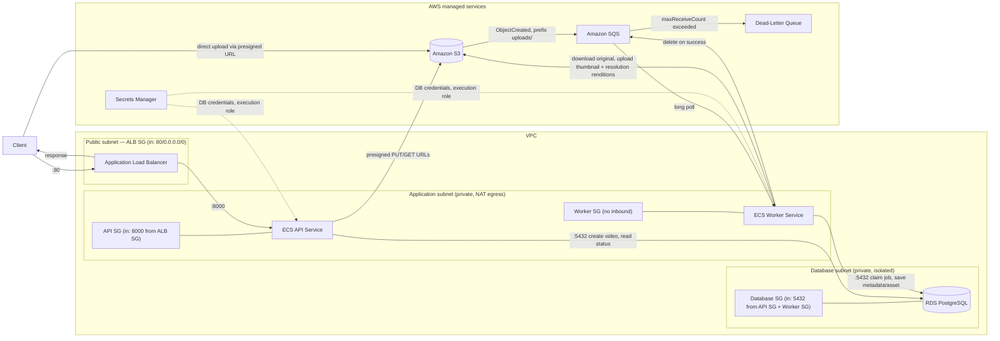

# Architecture

Detailed design reference for the platform: networking, security groups, compute, data stores, schemas, and system flows. See [`readme.md`](../readme.md) for the project overview and [`docs/DEVELOPMENT.md`](DEVELOPMENT.md) for local setup.

## High-Level Diagram



Notes:

- One NAT Gateway (in the public subnet) gives the application subnet outbound-only internet access (for pulling images, calling AWS APIs); nothing initiates inbound connections from the internet to the application or database subnets.
- The database subnet is fully isolated (no NAT route) — RDS has no path to or from the internet.
- The API and worker each run as their own ECS Fargate service/task definition/security group, so they can scale and fail independently (a core NFR of this project).

## Networking

| Layer | Type | Notes |
|---|---|---|
| VPC | 2 AZs | `max_azs=2` |
| Public subnet | `PUBLIC` | Hosts the ALB and the single NAT Gateway |
| Application subnet | `PRIVATE_WITH_EGRESS` | Hosts API and worker ECS tasks; outbound only, via NAT |
| Database subnet | `PRIVATE_ISOLATED` | Hosts RDS; no route in or out of the VPC |

One NAT Gateway (not one per AZ) is an intentional cost trade-off for a learning project — it's a single point of failure for outbound traffic, which would not be acceptable in a production environment.

## Security Groups

| Security group | Inbound | Outbound | Attached to |
|---|---|---|---|
| ALB SG | `0.0.0.0/0` : 80 | default (all) | Application Load Balancer |
| API SG | ALB SG : 8000 | all | API ECS tasks |
| Worker SG | none | all | Worker ECS tasks |
| Database SG | API SG : 5432, Worker SG : 5432 | none | RDS instance |

The API and worker security groups are separate so the database's inbound rules stay scoped to exactly the two things that need PostgreSQL access — nothing else in the VPC can reach it.

## Compute

- **ECS Cluster** — one Fargate cluster hosts all task definitions below; Container Insights enabled.
- **API Task Definition** (256 CPU / 512 MiB) — runs the FastAPI app on port 8000. Task role: `s3:PutObject` on `uploads/*` only (for presigned upload URLs). Execution role: read access to the RDS secret.
- **Worker Task Definition** (1024 CPU / 2048 MiB) — runs the poll loop (`python -m video_processing.worker.main`), no ports. Sized above ffmpeg-thumbnail-only needs since transcoding multiple resolution renditions per upload is meaningfully more CPU-bound. Task role: `s3:GetObject` on `uploads/*`, `s3:PutObject` on `assets/*`, and SQS consume permissions (receive/delete) on the processing queue.
- **Migration Task Definition** — one-off task running `alembic upgrade head` against RDS; run manually via `ecs run-task`, not part of a service.
- **Application Load Balancer** — public, listens on 80, forwards to the API service on 8000. Health check: `GET /health/ready` (verifies the API can reach the database, not just that the process is alive).

All three task definitions share the same container image (from ECR) with different commands, keeping the build/deploy pipeline simple for this project's scope.

## Data Stores

- **Amazon S3** — one bucket, blocks all public access, S3-managed encryption, TLS enforced. `uploads/` holds originals (its `ObjectCreated` events are the only ones routed to SQS); `assets/` holds generated assets — thumbnails and transcoded resolution renditions — deliberately excluded from the notification filter so the worker's own writes don't retrigger itself.
- **Amazon RDS (PostgreSQL 16)** — `db.t4g.micro`, single-AZ, 20 GB allocated (autoscales to 50 GB), generated Secrets Manager credentials, private/isolated subnet. Default parameter group caps `max_connections` at ~112 for this instance size; the API's connection pool (20 max: `pool_size=10` + `max_overflow=10`) and the worker's (3 max: strictly serial, one job at a time, so this is safety margin rather than real concurrency need) are both sized with that ceiling in mind, leaving headroom for horizontal scaling later without a config change.
- **Amazon SQS** — one processing queue (15 min visibility timeout, 20s long polling) plus a dead-letter queue (`maxReceiveCount=3`). S3 publishes directly to it; no SNS fan-out, since there's currently only one consumer.
- **Amazon ECR** — one repository (`video-processing`), scan-on-push, keeps the last 10 images.
- **Secrets Manager** — RDS-generated credentials, injected into both the API and worker containers as individual secret fields (host/port/username/password/dbname), not a raw connection string.

## Data Model

### `videos`

| Column | Type | Notes |
|---|---|---|
| `id` | UUID (PK) | |
| `filename` | `varchar(255)` | Original filename as submitted by the client |
| `original_object_key` | `varchar(1024)`, unique | e.g. `uploads/{id}/original.mp4` |
| `status` | enum | `pending_upload` \| `processing` \| `completed` \| `failed` |
| `duration_ms` | integer, nullable | Set by the worker; integer milliseconds avoids float precision issues |
| `width` / `height` | integer, nullable | Set by the worker |
| `created_at` | timestamptz | |

### `processing_jobs`

| Column | Type | Notes |
|---|---|---|
| `id` | UUID (PK) | |
| `video_id` | UUID (FK → `videos.id`, cascade delete) | |
| `job_type` | enum | `metadata` \| `thumbnail` \| `transcode` — independent jobs per video, each claimed/retried on its own; kept as an enum so the pipeline can add job types later |
| `status` | enum | `pending` \| `processing` \| `completed` \| `failed` |
| `attempts` | integer | Incremented every time the worker claims the job |
| `started_at` / `completed_at` | timestamptz, nullable | |

`UNIQUE(video_id, job_type)` — prevents duplicate jobs for the same video/workflow; this is what makes `claim_job` safe to call more than once for the same SQS redelivery.

### `generated_assets`

| Column | Type | Notes |
|---|---|---|
| `id` | UUID (PK) | |
| `video_id` | UUID (FK → `videos.id`, cascade delete) | |
| `asset_type` | enum | `thumbnail` \| `preview_1080p` \| `preview_720p` \| `preview_480p` |
| `object_key` | `varchar(1024)`, unique | e.g. `assets/{id}/thumbnail.jpg` or `assets/{id}/preview_720p.mp4` |
| `created_at` | timestamptz | |

`UNIQUE(video_id, asset_type)` — one asset per video per type (e.g. only one `preview_720p` rendition per video).

Enums are stored as their lowercase string values (not native PostgreSQL enum types), with a database check constraint — this keeps adding new enum values a simple migration rather than an `ALTER TYPE`.

## System Flows

### 1. Initialize an upload

```http
POST /videos
Content-Type: application/json

{ "filename": "demo.mp4", "content_type": "video/mp4" }
```

```text
Client → API → generate video_id + object key (uploads/{id}/original{ext})
             → presign an S3 PUT URL (15 min expiry)
             → insert Video(status=pending_upload)
             ← { id, status, upload_url, expires_at }
```

The video row is only committed after the presign call succeeds, so a broken S3/AWS configuration never leaves an unusable row behind.

```text
Client → S3 (direct PUT using the presigned URL)
```

Video bytes never pass through the API or ALB.

### 2. S3 publishes the upload event

```text
S3 (uploads/ prefix only) → ObjectCreated → SQS processing queue
```

S3 delivers at-least-once and the object key embeds the video ID, so the worker can always correlate the event back to its `Video` row — no second API call is required after the direct upload.

### 3. Worker processes the video

The worker runs three independent jobs per upload — `metadata`, `thumbnail`, and `transcode` — each its own `ProcessingJob` row, claimed and retried separately. All three currently run within one function call per S3 event (there's no separate scheduling between them; "independent" means independently retryable/observable, not concurrently executed):

```text
Worker → long-poll SQS (20s)
       → parse video_id from the object key
       → load Video, verify it matches the event's key
       → claim_job() for each of metadata / thumbnail / transcode:
             atomically create-or-resume that video's ProcessingJob row,
             set video status to "processing" (unless already "completed")
             (returns None if that job is already "completed" — handles SQS redelivery;
              if all three are already done, the event is skipped entirely)
       → download original from S3 once (shared by whichever jobs still need it)

       → [metadata job] ffprobe → duration_ms, width, height
                        → complete_metadata_job(): save the fields, mark this job completed

       → [thumbnail job] ffmpeg → one thumbnail (frame at 00:00:01)
                         → upload to assets/{id}/thumbnail.jpg
                         → complete_thumbnail_job(): create the GeneratedAsset, mark completed
                         (independent of the metadata job -- thumbnailing only needs the
                          downloaded file, not the extracted duration/dimensions)

       → [transcode job] uses metadata.height (this run's, or the video's stored value if
                          metadata was already done in an earlier attempt) to pick which
                          renditions to produce: only resolutions strictly below the source
                          height, from a fixed ladder (1080p/5000kbps, 720p/2500kbps,
                          480p/1000kbps) -- e.g. a 1080p upload produces 720p + 480p, never a
                          redundant 1080p copy; a video already at/below 480p produces none
                         → ffmpeg scale + libx264 encode each rendition at its target bitrate
                         → upload each to assets/{id}/preview_{height}p.mp4
                         → complete_transcode_job(): create each GeneratedAsset, mark completed

       → once every job type has a "completed" row for this video, mark the video "completed"
       → delete the SQS message
```

On any exception during processing: `fail_job()` marks the video and whichever jobs are still not `completed` as `failed` (a job that already finished earlier in this same run keeps its `completed` status). The SQS message is **not** deleted, and the function re-raises so the poll loop's `except` block skips the delete. SQS makes the message visible again after its visibility timeout, and another attempt begins automatically -- only the still-incomplete jobs are re-run, thanks to `claim_job` skipping ones already `completed`. After `maxReceiveCount` (3) the message moves to the dead-letter queue — a message parked in the DLQ needs manual intervention (redrive, or `POST /videos/{id}/retry` once the underlying issue is fixed).

### 4. Retrieve status

```http
GET /videos/{video_id}
```

```text
API → load Video (404 if missing)
    → include metadata only once duration_ms/width/height are all set
    → for each GeneratedAsset, presign a GET URL (15 min expiry)
    ← { id, filename, status, metadata, assets }
```

Clients poll this endpoint while `status` is `pending_upload` or `processing`.

### 5. Retry a failed video

```http
POST /videos/{video_id}/retry
```

```text
API → load Video (404 if missing, 409 if status != "failed")
    → re-publish the original upload's S3 ObjectCreated event to the processing queue
    → set video status to "processing"
    ← { id, status }
```

This doesn't duplicate any claim/complete logic — it re-drives the exact same path a real upload takes. `claim_job` already resumes any job not yet `completed`, so only the jobs that actually failed are re-run; ones that finished before the failure keep their `completed` status untouched. The message is built by `common/queue/s3_events.build_object_created_message`, the producer-side counterpart to the worker's `parse_object_created_events`.

### Supporting endpoints

```http
GET /health/live    # process is running — no dependency checks
GET /health/ready   # process can serve traffic — checks the database connection
```

The ALB health check uses `/health/ready`, so ECS won't route traffic to a task that's up but can't reach RDS.

## Status Model

The current enums have **no intermediate "queued" state** — the worker moves a video straight from `pending_upload` to `processing` when it claims the job (whether that's the first attempt or a retry):

```text
Video:        pending_upload → processing → completed | failed
ProcessingJob:            pending → processing → completed | failed
```

Note that `failed` is not necessarily final: if the same message is redelivered and reprocessed successfully, both rows move back to `completed`. `failed` becomes effectively final only once SQS exhausts its retries and the message lands in the dead-letter queue.
